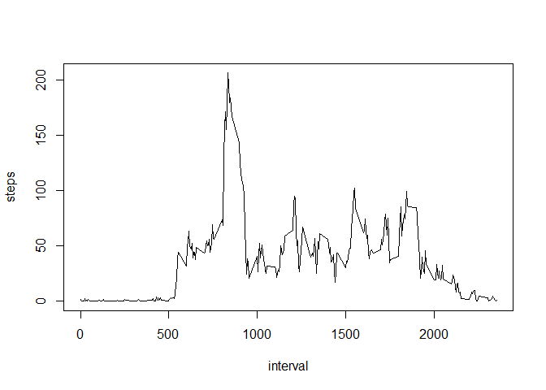

# Reproducible Research: Peer Assessment 1


## Loading and preprocessing the data

```r
# Read activity csv file from home directory
data <- read.csv('activity.csv')
```

## What is mean total number of steps taken per day?

```r
data.sum <- aggregate(steps ~ date, data = data, FUN = sum)
barplot(data.sum$steps, names.arg = data.sum$date, xlab = "Date",ylab = "Steps")
```

 

```r
meanstep<-mean(data.sum$steps,na.rm=TRUE)
medianstep<-median(data.sum$steps,na.rm=TRUE)
```
Mean no of steps taken per day: 10766 and 
Median no of steps taken per day: 10765

## What is the average daily activity pattern?

```r
data.mean <- aggregate(steps ~ interval, data = data, FUN = mean)
plot(data.mean, type = "l")
```

 

```r
maxstep<-data.mean$interval[which.max(data.mean$steps)]
```
Maximum average number of stemps in an interval is: 835

## Imputing missing values

```r
sum(is.na(data))
data <- merge(data, data.mean, by = "interval", suffixes = c("",".m"))
nadata <- is.na(data$steps)
data$steps[nadata] <- data$steps.m[nadata]
data <- data[, c(1:3)]

data.sum <- aggregate(steps ~ date, data = data, FUN = sum)
barplot(data.sum$steps, names.arg = data.sum$date, xlab = "Date",ylab = "Steps")
```

 

```r
meanstep<- mean(data.sum$steps,na.rm=TRUE)
medianstep<-median(data.sum$steps,na.rm=TRUE)
```
Mean no of steps taken per day after imputing missing values: 10766 and Median no of steps taken per day after imputing missing values: 10766


## Are there differences in activity patterns between weekdays and weekends?

```r
data$weekday <- weekdays(as.Date(data$date))
data$daytype <- 'weekday'
data$daytype[data$weekday %in% c('Saturday', 'Sunday')] <- 'weekend'
data$daytype<-as.factor(data$daytype)

par(mfrow = c(1, 1))
data.weekday <- aggregate(steps ~ interval, data = data,
                subset = data$daytype == "weekday", FUN = mean)
plot(data.weekday, type = "l", main = "Weekday")
```

 

```r
data.weekend <- aggregate(steps ~ interval, data = data,
                          subset = data$daytype == "weekend", FUN = mean)
plot(data.weekend, type = "l", main = "Weekend")
```

 

